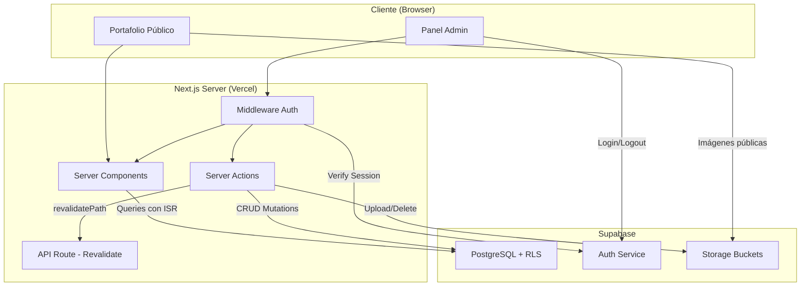
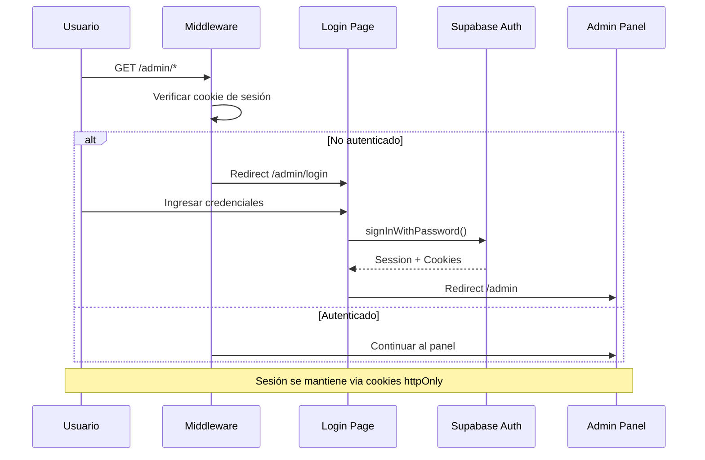
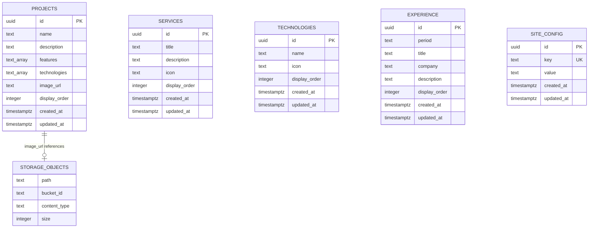

# Documento de Diseño: Panel de Administración con Supabase

## Overview

Este diseño describe la arquitectura técnica para integrar Supabase como backend del portafolio de Luis Porto y construir un panel de administración completo. El sistema reemplaza los archivos de datos estáticos actuales (`data/*.ts`) por consultas en tiempo real a Supabase, manteniendo el rendimiento mediante ISR (Incremental Static Regeneration) con revalidación cada 60 segundos.

La solución comprende tres capas principales:
1. **Capa de autenticación**: Login con email/password via Supabase Auth, protección de rutas con middleware de Next.js y gestión de sesiones con cookies (`@supabase/ssr`).
2. **Capa de administración**: Panel CRUD completo bajo `/admin` con formularios para proyectos, servicios, tecnologías, experiencia, configuración del sitio e imágenes.
3. **Capa pública**: Portafolio que consume datos desde Supabase con caché ISR y revalidación bajo demanda.

### Decisiones de Diseño Clave

| Decisión | Elección | Justificación |
|----------|----------|---------------|
| Paquete Supabase | `@supabase/ssr` + `@supabase/supabase-js` | Manejo nativo de cookies en Next.js App Router |
| Operaciones CRUD | Server Actions | Patrón nativo de Next.js, elimina API routes manuales |
| Caché público | ISR con `revalidate: 60` | Balance entre frescura de datos y rendimiento |
| Revalidación inmediata | `revalidatePath()` en Server Actions | Cambios del admin se reflejan al instante |
| Validación | Zod | Tipado seguro y validación compartida cliente/servidor |
| Imágenes | Supabase Storage | Integrado con auth, CDN incluido, policies RLS |

---

## Architecture

### Diagrama de Arquitectura General



### Diagrama de Flujo de Autenticación



### Estrategia de Clientes Supabase

Se utilizan tres instancias de cliente según el contexto de ejecución:

| Cliente | Archivo | Uso | Clave |
|---------|---------|-----|-------|
| Browser Client | `lib/supabase/client.ts` | Componentes client-side (login form) | `NEXT_PUBLIC_SUPABASE_ANON_KEY` |
| Server Client | `lib/supabase/server.ts` | Server Components, Server Actions | `NEXT_PUBLIC_SUPABASE_ANON_KEY` (con cookies) |
| Middleware Client | `lib/supabase/middleware.ts` | Middleware de Next.js | `NEXT_PUBLIC_SUPABASE_ANON_KEY` (con cookies) |

> **Nota**: El `SUPABASE_SERVICE_ROLE_KEY` se utiliza únicamente en el Server Client cuando se necesitan operaciones que bypaseen RLS (como eliminación de archivos en Storage por un admin autenticado).

---

## Components and Interfaces

### Estructura de Archivos

```
app/
├── (admin)/
│   └── admin/
│       ├── layout.tsx          ← Layout con sidebar
│       ├── page.tsx            ← Dashboard
│       ├── login/
│       │   └── page.tsx        ← Formulario de login
│       ├── projects/
│       │   └── page.tsx        ← CRUD Proyectos
│       ├── services/
│       │   └── page.tsx        ← CRUD Servicios
│       ├── technologies/
│       │   └── page.tsx        ← CRUD Tecnologías
│       ├── experience/
│       │   └── page.tsx        ← CRUD Experiencia
│       ├── settings/
│       │   └── page.tsx        ← Config del sitio
│       └── images/
│           └── page.tsx        ← Gestión de imágenes
├── (public)/
│   ├── layout.tsx              ← Layout público
│   └── page.tsx                ← Portafolio
lib/
├── supabase/
│   ├── client.ts               ← createBrowserClient
│   ├── server.ts               ← createServerClient
│   └── middleware.ts           ← createMiddlewareClient
├── actions/
│   ├── projects.ts             ← Server Actions de proyectos
│   ├── services.ts             ← Server Actions de servicios
│   ├── technologies.ts         ← Server Actions de tecnologías
│   ├── experience.ts           ← Server Actions de experiencia
│   ├── settings.ts             ← Server Actions de configuración
│   └── images.ts               ← Server Actions de imágenes
├── queries/
│   ├── projects.ts             ← Queries públicas
│   ├── services.ts
│   ├── technologies.ts
│   ├── experience.ts
│   └── settings.ts
├── validations/
│   ├── projects.ts             ← Schemas Zod
│   ├── services.ts
│   ├── technologies.ts
│   ├── experience.ts
│   ├── settings.ts
│   └── images.ts
├── types.ts                    ← Tipos actualizados (con DB types)
└── utils.ts
middleware.ts                   ← Auth middleware
```

### Interfaces TypeScript

```typescript
// lib/types.ts - Tipos actualizados para Supabase

// Tipos base de la base de datos
export interface DbProject {
  id: string;           // uuid
  name: string;
  description: string;
  features: string[];   // text[]
  technologies: string[]; // text[]
  image_url: string | null;
  display_order: number;
  created_at: string;
  updated_at: string;
}

export interface DbService {
  id: string;           // uuid
  title: string;
  description: string;
  icon: string;         // nombre del ícono Lucide
  display_order: number;
  created_at: string;
  updated_at: string;
}

export interface DbTechnology {
  id: string;           // uuid
  name: string;
  icon: string;         // identificador del ícono
  display_order: number;
  created_at: string;
  updated_at: string;
}

export interface DbExperience {
  id: string;           // uuid
  period: string;
  title: string;
  company: string;
  description: string;
  display_order: number;
  created_at: string;
  updated_at: string;
}

export interface DbSiteConfig {
  id: string;           // uuid
  key: string;
  value: string;
  created_at: string;
  updated_at: string;
}

// Tipos para formularios (sin campos auto-generados)
export interface ProjectFormData {
  name: string;
  description: string;
  features: string[];
  technologies: string[];
  image_url?: string | null;
  display_order?: number;
}

export interface ServiceFormData {
  title: string;
  description: string;
  icon: string;
  display_order?: number;
}

export interface TechnologyFormData {
  name: string;
  icon: string;
  display_order?: number;
}

export interface ExperienceFormData {
  period: string;
  title: string;
  company: string;
  description: string;
  display_order?: number;
}

export interface SiteConfigFormData {
  name: string;
  title: string;
  description: string;
  url: string;
  ogImage: string;
  email: string;
  whatsappUrl: string;
  social: {
    github: string;
    linkedin: string;
    whatsapp: string;
  };
}

// Tipos de respuesta para Server Actions
export interface ActionResult<T = void> {
  success: boolean;
  data?: T;
  error?: string;
}

// Tipos para imágenes
export interface ImageUploadResult {
  url: string;
  path: string;
}

export type ImageFolder = 'profile' | 'og' | 'projects';

export interface ImageMetadata {
  name: string;
  path: string;
  url: string;
  size: number;
  contentType: string;
  folder: ImageFolder;
  createdAt: string;
}
```

### Componentes del Panel Admin

```typescript
// Componentes compartidos del admin
interface AdminLayoutProps {
  children: React.ReactNode;
}

interface SidebarProps {
  currentPath: string;
}

interface SidebarNavItem {
  label: string;
  href: string;
  icon: string; // Nombre ícono Lucide
}

interface DataTableProps<T> {
  data: T[];
  columns: ColumnDef<T>[];
  onEdit: (item: T) => void;
  onDelete: (id: string) => void;
}

interface FormModalProps {
  open: boolean;
  onClose: () => void;
  title: string;
  children: React.ReactNode;
}

interface ConfirmDialogProps {
  open: boolean;
  title: string;
  message: string;
  onConfirm: () => void;
  onCancel: () => void;
}

interface ImageUploaderProps {
  folder: ImageFolder;
  currentUrl?: string | null;
  onUpload: (result: ImageUploadResult) => void;
  maxSizeMB?: number; // default 5
  acceptedTypes?: string[]; // default ['image/jpeg', 'image/png', 'image/webp', 'image/svg+xml']
}
```

### Schemas de Validación (Zod)

```typescript
// lib/validations/projects.ts
import { z } from 'zod';

export const projectSchema = z.object({
  name: z.string().min(1, 'El nombre es requerido').max(100),
  description: z.string().min(1, 'La descripción es requerida').max(500),
  features: z.array(z.string().min(1)).min(1, 'Al menos una característica'),
  technologies: z.array(z.string().min(1)).min(1, 'Al menos una tecnología'),
  image_url: z.string().url().nullable().optional(),
  display_order: z.number().int().min(0).optional(),
});

// lib/validations/services.ts
export const serviceSchema = z.object({
  title: z.string().min(1, 'El título es requerido').max(100),
  description: z.string().min(1, 'La descripción es requerida').max(300),
  icon: z.string().min(1, 'El ícono es requerido'),
  display_order: z.number().int().min(0).optional(),
});

// lib/validations/technologies.ts
export const technologySchema = z.object({
  name: z.string().min(1, 'El nombre es requerido').max(50),
  icon: z.string().min(1, 'El ícono es requerido'),
  display_order: z.number().int().min(0).optional(),
});

// lib/validations/experience.ts
export const experienceSchema = z.object({
  period: z.string().min(1, 'El período es requerido'),
  title: z.string().min(1, 'El título es requerido').max(100),
  company: z.string().min(1, 'La empresa es requerida').max(100),
  description: z.string().min(1, 'La descripción es requerida').max(500),
  display_order: z.number().int().min(0).optional(),
});

// lib/validations/settings.ts
export const siteConfigSchema = z.object({
  name: z.string().min(1),
  title: z.string().min(1),
  description: z.string().min(1),
  url: z.string().url('URL con formato inválido'),
  ogImage: z.string().min(1),
  email: z.string().email('Email con formato inválido'),
  whatsappUrl: z.string().url('URL de WhatsApp con formato inválido'),
  social: z.object({
    github: z.string().url('URL de GitHub con formato inválido'),
    linkedin: z.string().url('URL de LinkedIn con formato inválido'),
    whatsapp: z.string().url('URL de WhatsApp con formato inválido'),
  }),
});

// lib/validations/images.ts
export const imageUploadSchema = z.object({
  file: z.custom<File>()
    .refine((f) => f.size <= 5 * 1024 * 1024, 'El archivo no puede exceder 5MB')
    .refine(
      (f) => ['image/jpeg', 'image/png', 'image/webp', 'image/svg+xml'].includes(f.type),
      'Tipo de archivo no permitido. Use JPEG, PNG, WebP o SVG'
    ),
  folder: z.enum(['profile', 'og', 'projects']),
});
```

---

## Data Models

### Esquema PostgreSQL

```sql
-- Tabla de proyectos
CREATE TABLE projects (
  id UUID DEFAULT gen_random_uuid() PRIMARY KEY,
  name TEXT NOT NULL,
  description TEXT NOT NULL,
  features TEXT[] NOT NULL DEFAULT '{}',
  technologies TEXT[] NOT NULL DEFAULT '{}',
  image_url TEXT,
  display_order INTEGER NOT NULL DEFAULT 0,
  created_at TIMESTAMPTZ DEFAULT NOW(),
  updated_at TIMESTAMPTZ DEFAULT NOW()
);

-- Tabla de servicios
CREATE TABLE services (
  id UUID DEFAULT gen_random_uuid() PRIMARY KEY,
  title TEXT NOT NULL,
  description TEXT NOT NULL,
  icon TEXT NOT NULL,
  display_order INTEGER NOT NULL DEFAULT 0,
  created_at TIMESTAMPTZ DEFAULT NOW(),
  updated_at TIMESTAMPTZ DEFAULT NOW()
);

-- Tabla de tecnologías
CREATE TABLE technologies (
  id UUID DEFAULT gen_random_uuid() PRIMARY KEY,
  name TEXT NOT NULL,
  icon TEXT NOT NULL,
  display_order INTEGER NOT NULL DEFAULT 0,
  created_at TIMESTAMPTZ DEFAULT NOW(),
  updated_at TIMESTAMPTZ DEFAULT NOW()
);

-- Tabla de experiencia laboral
CREATE TABLE experience (
  id UUID DEFAULT gen_random_uuid() PRIMARY KEY,
  period TEXT NOT NULL,
  title TEXT NOT NULL,
  company TEXT NOT NULL,
  description TEXT NOT NULL,
  display_order INTEGER NOT NULL DEFAULT 0,
  created_at TIMESTAMPTZ DEFAULT NOW(),
  updated_at TIMESTAMPTZ DEFAULT NOW()
);

-- Tabla de configuración del sitio (key-value store)
CREATE TABLE site_config (
  id UUID DEFAULT gen_random_uuid() PRIMARY KEY,
  key TEXT UNIQUE NOT NULL,
  value TEXT NOT NULL,
  created_at TIMESTAMPTZ DEFAULT NOW(),
  updated_at TIMESTAMPTZ DEFAULT NOW()
);

-- Trigger para actualizar updated_at automáticamente
CREATE OR REPLACE FUNCTION update_updated_at()
RETURNS TRIGGER AS $$
BEGIN
  NEW.updated_at = NOW();
  RETURN NEW;
END;
$$ LANGUAGE plpgsql;

CREATE TRIGGER projects_updated_at BEFORE UPDATE ON projects
  FOR EACH ROW EXECUTE FUNCTION update_updated_at();
CREATE TRIGGER services_updated_at BEFORE UPDATE ON services
  FOR EACH ROW EXECUTE FUNCTION update_updated_at();
CREATE TRIGGER technologies_updated_at BEFORE UPDATE ON technologies
  FOR EACH ROW EXECUTE FUNCTION update_updated_at();
CREATE TRIGGER experience_updated_at BEFORE UPDATE ON experience
  FOR EACH ROW EXECUTE FUNCTION update_updated_at();
CREATE TRIGGER site_config_updated_at BEFORE UPDATE ON site_config
  FOR EACH ROW EXECUTE FUNCTION update_updated_at();
```

### Políticas RLS

```sql
-- Habilitar RLS en todas las tablas
ALTER TABLE projects ENABLE ROW LEVEL SECURITY;
ALTER TABLE services ENABLE ROW LEVEL SECURITY;
ALTER TABLE technologies ENABLE ROW LEVEL SECURITY;
ALTER TABLE experience ENABLE ROW LEVEL SECURITY;
ALTER TABLE site_config ENABLE ROW LEVEL SECURITY;

-- Lectura pública para todas las tablas
CREATE POLICY "Lectura pública de proyectos" ON projects
  FOR SELECT USING (true);
CREATE POLICY "Lectura pública de servicios" ON services
  FOR SELECT USING (true);
CREATE POLICY "Lectura pública de tecnologías" ON technologies
  FOR SELECT USING (true);
CREATE POLICY "Lectura pública de experiencia" ON experience
  FOR SELECT USING (true);
CREATE POLICY "Lectura pública de configuración" ON site_config
  FOR SELECT USING (true);

-- Escritura restringida a usuarios autenticados
CREATE POLICY "Escritura admin en proyectos" ON projects
  FOR ALL USING (auth.role() = 'authenticated')
  WITH CHECK (auth.role() = 'authenticated');
CREATE POLICY "Escritura admin en servicios" ON services
  FOR ALL USING (auth.role() = 'authenticated')
  WITH CHECK (auth.role() = 'authenticated');
CREATE POLICY "Escritura admin en tecnologías" ON technologies
  FOR ALL USING (auth.role() = 'authenticated')
  WITH CHECK (auth.role() = 'authenticated');
CREATE POLICY "Escritura admin en experiencia" ON experience
  FOR ALL USING (auth.role() = 'authenticated')
  WITH CHECK (auth.role() = 'authenticated');
CREATE POLICY "Escritura admin en configuración" ON site_config
  FOR ALL USING (auth.role() = 'authenticated')
  WITH CHECK (auth.role() = 'authenticated');
```

### Configuración de Storage

```sql
-- Bucket para imágenes del portafolio
INSERT INTO storage.buckets (id, name, public) 
VALUES ('portfolio-images', 'portfolio-images', true);

-- Política: lectura pública
CREATE POLICY "Lectura pública de imágenes" ON storage.objects
  FOR SELECT USING (bucket_id = 'portfolio-images');

-- Política: escritura solo para autenticados
CREATE POLICY "Escritura admin de imágenes" ON storage.objects
  FOR INSERT WITH CHECK (
    bucket_id = 'portfolio-images' AND auth.role() = 'authenticated'
  );
CREATE POLICY "Actualización admin de imágenes" ON storage.objects
  FOR UPDATE USING (
    bucket_id = 'portfolio-images' AND auth.role() = 'authenticated'
  );
CREATE POLICY "Eliminación admin de imágenes" ON storage.objects
  FOR DELETE USING (
    bucket_id = 'portfolio-images' AND auth.role() = 'authenticated'
  );
```

### Diagrama Entidad-Relación



### Datos Iniciales de Configuración

Las claves de `site_config` almacenan la configuración como pares key-value:

| Key | Ejemplo de Valor |
|-----|-----------------|
| `site.name` | `"Luis Porto"` |
| `site.title` | `"Luis Porto \| Full Stack Developer"` |
| `site.description` | `"Portafolio profesional de Luis Porto..."` |
| `site.url` | `"https://luisporto.dev"` |
| `site.ogImage` | `"/images/og-image.png"` |
| `site.email` | `"contacto@luisporto.dev"` |
| `site.whatsappUrl` | `"https://wa.me/NUMERO"` |
| `social.github` | `"https://github.com/luisporto"` |
| `social.linkedin` | `"https://linkedin.com/in/luisporto"` |
| `social.whatsapp` | `"https://wa.me/NUMERO"` |


---

## Correctness Properties

*Una propiedad es una característica o comportamiento que debe mantenerse verdadero a través de todas las ejecuciones válidas de un sistema — esencialmente, una declaración formal sobre lo que el sistema debe hacer. Las propiedades sirven como puente entre especificaciones legibles por humanos y garantías de correctitud verificables por máquinas.*

### Property 1: Datos CRUD válidos pasan validación

*Para cualquier* `ProjectFormData`, `ServiceFormData`, `TechnologyFormData`, `ExperienceFormData` o `SiteConfigFormData` que contenga todos los campos requeridos con valores no vacíos y formatos correctos, la validación con el schema Zod correspondiente SHALL retornar éxito sin errores.

**Validates: Requirements 3.3, 3.5, 4.2, 4.3, 5.2, 5.3, 6.2, 6.3, 7.2**

### Property 2: Campos requeridos faltantes son rechazados

*Para cualquier* formulario de datos (proyecto, servicio, tecnología, experiencia) en el que al menos un campo requerido esté vacío o ausente, la validación con el schema Zod correspondiente SHALL retornar un error indicando los campos faltantes, y ningún dato SHALL ser enviado al servidor.

**Validates: Requirements 3.8, 4.6, 5.5, 6.5**

### Property 3: Formatos inválidos de email y URL son rechazados

*Para cualquier* string que no cumpla el formato de email válido (según RFC 5322 simplificado) o el formato de URL válida (con protocolo https://), la validación del schema de configuración del sitio SHALL retornar un error de formato sin permitir el envío al servidor.

**Validates: Requirements 7.3, 7.4**

### Property 4: Validación de archivos de imagen

*Para cualquier* archivo con tamaño mayor a 5MB O con tipo MIME diferente a `image/jpeg`, `image/png`, `image/webp`, `image/svg+xml`, la validación de subida SHALL rechazar el archivo y retornar un mensaje de error descriptivo. Inversamente, *para cualquier* archivo con tamaño menor o igual a 5MB Y con tipo MIME permitido, la validación SHALL aceptar el archivo.

**Validates: Requirements 8.1, 8.5, 12.6**

### Property 5: Sanitización de texto elimina contenido peligroso

*Para cualquier* string de entrada que contenga etiquetas HTML (`<script>`, `<iframe>`, ``, etc.) o atributos de eventos JavaScript, la función de sanitización SHALL producir un string donde dichos elementos hayan sido eliminados o escapados, mientras preserva el texto plano legible.

**Validates: Requirements 12.5**

### Property 6: Mutaciones exitosas invocan revalidación

*Para cualquier* Server Action de creación, actualización o eliminación que complete exitosamente, la acción SHALL invocar `revalidatePath` con la ruta pública correspondiente, garantizando que los cambios se reflejen inmediatamente en el portafolio público.

**Validates: Requirements 11.4**

---

## Error Handling

### Estrategia por Capa

| Capa | Tipo de Error | Manejo |
|------|---------------|--------|
| Validación (Client) | Campos vacíos, formatos inválidos | Mensajes inline bajo cada campo, NO enviar al servidor |
| Validación (Server) | Datos malformados post-sanitización | Retornar `ActionResult` con `success: false` y `error` descriptivo |
| Autenticación | Sesión expirada/inválida | Redirect a `/admin/login` con mensaje |
| Base de datos | Error de conexión, constraint violation | Log en servidor, mostrar toast genérico al usuario |
| Storage | Upload fallido, archivo no encontrado | Retornar error descriptivo, no corromper registro en DB |
| Red/Supabase | Timeout, servicio no disponible | Portafolio público: mostrar página de error genérica. Admin: toast con retry |

### Flujo de Error en Server Actions

```typescript
// Patrón de manejo de errores en Server Actions
'use server';

export async function createProject(formData: ProjectFormData): Promise<ActionResult<DbProject>> {
  // 1. Validar con Zod
  const validation = projectSchema.safeParse(formData);
  if (!validation.success) {
    return { success: false, error: validation.error.issues[0].message };
  }

  // 2. Sanitizar texto
  const sanitized = sanitizeFormData(validation.data);

  // 3. Verificar autenticación
  const supabase = await createServerClient();
  const { data: { user } } = await supabase.auth.getUser();
  if (!user) {
    return { success: false, error: 'No autorizado' };
  }

  // 4. Ejecutar operación
  const { data, error } = await supabase
    .from('projects')
    .insert(sanitized)
    .select()
    .single();

  if (error) {
    console.error('Error creating project:', error);
    return { success: false, error: 'Error al crear el proyecto' };
  }

  // 5. Revalidar caché
  revalidatePath('/');
  
  return { success: true, data };
}
```

### Errores del Portafolio Público

```typescript
// lib/queries/projects.ts
export async function getProjects(): Promise<DbProject[]> {
  const supabase = createServerClient();
  
  const { data, error } = await supabase
    .from('projects')
    .select('*')
    .order('display_order', { ascending: true });

  if (error) {
    console.error('Error fetching projects:', error);
    throw new Error('Failed to fetch projects');
  }

  return data;
}
```

El archivo `app/(public)/error.tsx` captura errores no manejados y muestra una página genérica sin detalles técnicos.

### Mensajes de Error al Usuario

- **Validación**: Mensajes específicos por campo ("El nombre es requerido", "Email con formato inválido")
- **Autenticación**: "Credenciales incorrectas. Verifica tu email y contraseña." (genérico, no revela si email existe)
- **Operaciones CRUD**: "Error al guardar los cambios. Intenta de nuevo."
- **Subida de imágenes**: "El archivo excede 5MB" / "Tipo de archivo no permitido"
- **Sesión expirada**: "Tu sesión ha expirado. Inicia sesión nuevamente."
- **Error público**: "Estamos experimentando dificultades técnicas. Intenta más tarde."

---

## Testing Strategy

### Enfoque Dual

La estrategia combina **tests unitarios basados en ejemplos** y **tests basados en propiedades** para cobertura integral.

### Tests Basados en Propiedades (Property-Based Testing)

**Librería**: `fast-check` (ya instalada en el proyecto)  
**Framework**: `vitest` (ya configurado)  
**Configuración**: Mínimo 100 iteraciones por propiedad

Cada propiedad del documento se implementa como un único test de propiedades:

| Propiedad | Archivo de Test | Descripción |
|-----------|----------------|-------------|
| 1 | `__tests__/properties/crud-validation-valid.test.ts` | Datos válidos pasan validación |
| 2 | `__tests__/properties/crud-validation-required.test.ts` | Campos requeridos faltantes rechazan |
| 3 | `__tests__/properties/format-validation.test.ts` | Email/URL inválidos son rechazados |
| 4 | `__tests__/properties/image-validation.test.ts` | Validación de archivos de imagen |
| 5 | `__tests__/properties/text-sanitization.test.ts` | Sanitización elimina contenido peligroso |
| 6 | `__tests__/properties/revalidation-on-mutation.test.ts` | Mutaciones invocan revalidación |

**Formato de etiquetado**:
```typescript
// Feature: admin-panel-supabase, Property 1: Valid CRUD data passes validation
```

### Tests Unitarios (Basados en Ejemplos)

| Área | Archivo | Cobertura |
|------|---------|-----------|
| Middleware Auth | `__tests__/unit/middleware.test.ts` | Redirect sin sesión, pass con sesión |
| Login Flow | `__tests__/unit/login.test.ts` | Credenciales válidas/inválidas, UI feedback |
| Sidebar Nav | `__tests__/unit/sidebar.test.ts` | Items de navegación, ruta activa |
| Data Tables | `__tests__/unit/data-table.test.ts` | Render de filas, acciones |
| Error Handling | `__tests__/unit/error-boundary.test.ts` | Página de error genérica sin detalles |

### Tests de Integración

| Área | Descripción |
|------|-------------|
| CRUD completo | Create → Read → Update → Delete con Supabase mock |
| Storage upload/delete | Flujo completo de subida y eliminación de imágenes |
| Session lifecycle | Login → navegar → logout → redirect |
| Public queries | Fetch datos con ISR mock, verificar render |

### Dependencias Nuevas de Testing

```json
{
  "devDependencies": {
    "zod": "^3.23.0"
  },
  "dependencies": {
    "@supabase/supabase-js": "^2.45.0",
    "@supabase/ssr": "^0.5.0",
    "zod": "^3.23.0"
  }
}
```

> **Nota**: `zod` se usa tanto en runtime (validación de formularios) como en tests. `fast-check` ya está disponible como devDependency.

### Estructura de Tests

```
__tests__/
├── properties/
│   ├── crud-validation-valid.test.ts
│   ├── crud-validation-required.test.ts
│   ├── format-validation.test.ts
│   ├── image-validation.test.ts
│   ├── text-sanitization.test.ts
│   └── revalidation-on-mutation.test.ts
├── unit/
│   ├── middleware.test.ts
│   ├── login.test.ts
│   ├── sidebar.test.ts
│   ├── data-table.test.ts
│   └── error-boundary.test.ts
└── integration/
    ├── crud-projects.test.ts
    ├── crud-services.test.ts
    ├── storage-upload.test.ts
    └── session-lifecycle.test.ts
```
