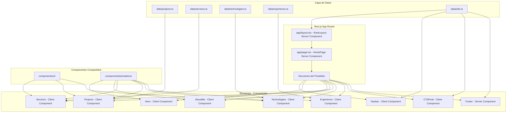

# Documento de Diseño Técnico

## Overview

Este documento describe la arquitectura y diseño técnico del portafolio web premium de Luis Porto. La aplicación es un sitio de página única (SPA) construido con Next.js 15 App Router, TypeScript, Tailwind CSS v4, Framer Motion, Shadcn/UI y Lucide React. El objetivo es crear una experiencia visual de alta calidad con tema oscuro elegante, animaciones sutiles y excelente rendimiento, desplegado en Vercel.

La aplicación sigue una arquitectura modular basada en componentes React con clara separación entre Server Components (por defecto) y Client Components (solo cuando se requieren interacciones del navegador o animaciones). Los datos son estáticos y se definen como constantes TypeScript tipadas.

---

## Architecture

### Diagrama de Arquitectura de Alto Nivel



### Decisiones Arquitectónicas Clave

| Decisión | Justificación |
|----------|---------------|
| Server Components por defecto | Reduce JavaScript enviado al cliente. Solo se usa `"use client"` donde se necesitan hooks, eventos o Framer Motion. |
| Datos estáticos como constantes TypeScript | No se necesita CMS ni base de datos. Los datos se importan directamente, permitiendo tipado fuerte y tree-shaking. |
| App Router de Next.js | Aprovecha layouts, metadata API, streaming y Server Components nativos. |
| Tailwind CSS v4 con `@theme` | Configuración de tema via CSS, compatible con el setup existente en `globals.css`. |
| Framer Motion para animaciones | Librería estándar para animaciones declarativas en React con soporte de gestos, scroll y reducción de movimiento. |
| Componentes de animación reutilizables | Wrappers genéricos (`FadeIn`, `SlideUp`, `StaggerContainer`) evitan duplicación de lógica de animación. |

---

## Components and Interfaces

### Estructura de Carpetas

```
app/
├── layout.tsx              # RootLayout (Server Component) - metadata, fuentes, tema
├── page.tsx                # HomePage (Server Component) - composición de secciones
├── globals.css             # Estilos globales y configuración de tema Tailwind
├── favicon.ico
components/
├── sections/
│   ├── Navbar.tsx          # Client Component - navegación sticky con menú móvil
│   ├── Hero.tsx            # Client Component - presentación principal con animaciones
│   ├── AboutMe.tsx         # Client Component - perfil profesional con fade in
│   ├── Services.tsx        # Client Component - tarjetas de servicios con hover
│   ├── Projects.tsx        # Client Component - tarjetas de proyectos con hover
│   ├── Technologies.tsx    # Client Component - grid de tecnologías con animación
│   ├── Experience.tsx      # Client Component - timeline de experiencia
│   ├── CTAFinal.tsx        # Client Component - llamada a la acción final
│   └── Footer.tsx          # Server Component - pie de página estático
├── ui/
│   ├── Button.tsx          # Botón reutilizable con variantes
│   ├── Badge.tsx           # Badge para tecnologías y etiquetas
│   ├── Card.tsx            # Tarjeta base con glassmorphism
│   └── SectionHeading.tsx  # Encabezado de sección reutilizable
├── animations/
│   ├── FadeIn.tsx          # Wrapper de animación fade in al scroll
│   ├── SlideUp.tsx         # Wrapper de animación slide up al scroll
│   ├── StaggerContainer.tsx # Contenedor para animaciones escalonadas
│   └── FloatingImage.tsx   # Animación flotante continua para la foto
data/
├── projects.ts             # Datos de proyectos destacados
├── services.ts             # Datos de servicios ofrecidos
├── technologies.ts         # Datos de tecnologías con iconos
├── experience.ts           # Datos de experiencia profesional
├── site.ts                 # Datos globales del sitio (URLs, contacto, metadata)
├── navigation.ts           # Enlaces de navegación
lib/
├── types.ts                # Tipos TypeScript compartidos
└── utils.ts                # Utilidades (cn para classnames, etc.)
public/
├── images/
│   ├── luis-porto.webp     # Fotografía profesional optimizada
│   └── og-image.png        # Imagen Open Graph (1200x630)
```

### Interfaces TypeScript Principales

```typescript
// lib/types.ts

export interface Project {
  id: string;
  name: string;
  description: string;
  features: string[];
  technologies: string[];
}

export interface Service {
  id: string;
  title: string;
  description: string;
  icon: string; // nombre del icono de Lucide
}

export interface Technology {
  id: string;
  name: string;
  icon: string; // nombre del icono o path al SVG
}

export interface ExperienceEntry {
  id: string;
  period: string;
  title: string;
  company: string;
  description: string;
}

export interface NavLink {
  label: string;
  href: string; // formato "#seccion"
}

export interface SiteConfig {
  name: string;
  title: string;
  description: string;
  url: string;
  ogImage: string;
  whatsappUrl: string;
  email: string;
  social: {
    github: string;
    linkedin: string;
    whatsapp: string;
  };
}
```

### Componentes de Animación - API

```typescript
// components/animations/FadeIn.tsx
interface FadeInProps {
  children: React.ReactNode;
  duration?: number;      // default: 0.6 (600ms)
  delay?: number;         // default: 0
  className?: string;
}

// components/animations/SlideUp.tsx
interface SlideUpProps {
  children: React.ReactNode;
  duration?: number;      // default: 0.6
  delay?: number;         // default: 0
  offset?: number;        // default: 20 (px)
  className?: string;
}

// components/animations/StaggerContainer.tsx
interface StaggerContainerProps {
  children: React.ReactNode;
  staggerDelay?: number;  // default: 0.1 (100ms)
  className?: string;
}

// components/animations/FloatingImage.tsx
interface FloatingImageProps {
  children: React.ReactNode;
  amplitude?: number;     // default: 10 (px)
  duration?: number;      // default: 3 (seconds)
}
```

### Componentes UI - API

```typescript
// components/ui/Button.tsx
interface ButtonProps {
  children: React.ReactNode;
  variant?: "primary" | "secondary" | "ghost";
  size?: "sm" | "md" | "lg";
  href?: string;
  onClick?: () => void;
  className?: string;
  external?: boolean; // abre en nueva pestaña
}

// components/ui/Card.tsx
interface CardProps {
  children: React.ReactNode;
  hover?: boolean;        // activa efecto hover
  className?: string;
}

// components/ui/Badge.tsx
interface BadgeProps {
  children: React.ReactNode;
  icon?: React.ReactNode;
  className?: string;
}

// components/ui/SectionHeading.tsx
interface SectionHeadingProps {
  title: string;
  subtitle?: string;
  className?: string;
}
```

---

## Data Models

### Datos Estáticos

Los datos del portafolio se almacenan como constantes TypeScript exportadas. No se usa base de datos ni CMS externo.

```typescript
// data/projects.ts
export const projects: Project[] = [
  {
    id: "miconsultorio",
    name: "MiConsultorio",
    description: "Sistema de gestión médica integral para consultorios",
    features: [
      "Agenda médica",
      "Gestión de pacientes", 
      "Historia clínica",
      "Control de citas"
    ],
    technologies: ["Next.js", "PostgreSQL", "Supabase"]
  },
  {
    id: "rinas-gallos",
    name: "Sistema de Riñas de Gallos",
    description: "Plataforma de administración de eventos y estadísticas",
    features: [
      "Gestión de ejemplares",
      "Programación de peleas",
      "Estadísticas",
      "Reportes"
    ],
    technologies: ["Next.js", "PostgreSQL"]
  },
  {
    id: "porto-soluciones",
    name: "Porto Soluciones",
    description: "Sitio corporativo con landing optimizada para captación",
    features: [
      "Landing corporativa",
      "Captación de clientes",
      "SEO optimizado"
    ],
    technologies: ["Next.js", "Tailwind CSS"]
  }
];

// data/services.ts
export const services: Service[] = [
  {
    id: "desarrollo-web",
    title: "Desarrollo Web",
    description: "Aplicaciones modernas, rápidas y escalables",
    icon: "Globe"
  },
  {
    id: "sistemas-empresariales",
    title: "Sistemas Empresariales",
    description: "Software personalizado para optimizar procesos",
    icon: "Building2"
  },
  {
    id: "automatizacion",
    title: "Automatización",
    description: "Digitalización y automatización de tareas operativas",
    icon: "Zap"
  }
];

// data/experience.ts
export const experience: ExperienceEntry[] = [
  {
    id: "porto-soluciones-fundador",
    period: "2024 - Actualidad",
    title: "Fundador",
    company: "Porto Soluciones",
    description: "Desarrollo de soluciones empresariales y aplicaciones web modernas"
  }
];
```

### Configuración del Sitio

```typescript
// data/site.ts
export const siteConfig: SiteConfig = {
  name: "Luis Porto",
  title: "Luis Porto | Full Stack Developer",
  description: "Portafolio profesional de Luis Porto. Desarrollo de aplicaciones web modernas, sistemas empresariales y soluciones digitales escalables.",
  url: "https://luisporto.dev", // URL de producción en Vercel
  ogImage: "/images/og-image.png",
  whatsappUrl: "https://wa.me/NUMERO",
  email: "contacto@luisporto.dev",
  social: {
    github: "https://github.com/luisporto",
    linkedin: "https://linkedin.com/in/luisporto",
    whatsapp: "https://wa.me/NUMERO"
  }
};
```

### Configuración de Tema (Tailwind CSS v4)

```css
/* app/globals.css */
@import "tailwindcss";

@theme inline {
  --color-background: #0B0F19;
  --color-foreground: #FFFFFF;
  --color-card: #111827;
  --color-primary: #4F46E5;
  --color-secondary: #7C3AED;
  --color-muted: #9CA3AF;
  --color-border: rgba(255, 255, 255, 0.1);
  --font-sans: "Inter", system-ui, sans-serif;
}
```

---

## Error Handling

### Estrategia por Capa

| Capa | Estrategia |
|------|-----------|
| **Imágenes** | Componente `next/image` con placeholder `blur` o fallback visual. Si la imagen falla, se muestra un div con las dimensiones esperadas y un icono de fallback. |
| **Enlaces externos** | Uso consistente de `target="_blank"` con `rel="noopener noreferrer"`. Los enlaces de WhatsApp y mailto funcionan sin dependencia de APIs externas. |
| **Navegación** | Smooth scroll con fallback nativo del navegador. Si JavaScript no carga, los enlaces `#section` funcionan con scroll instantáneo. |
| **Fuentes** | La fuente Inter se carga con `next/font/google` con fallback a `system-ui, sans-serif`. Si la fuente falla, la UI permanece legible. |
| **Animaciones** | Framer Motion respeta `prefers-reduced-motion`. Si la librería falla en cargar, los componentes muestran su estado final sin animación. |
| **Menú Móvil** | Estado controlado con `useState`. Si JavaScript no está disponible, los enlaces de navegación permanecen visibles (progressive enhancement). |

### Boundaries de Error

```typescript
// El layout principal no necesita error boundaries complejos ya que:
// 1. No hay fetching de datos externos
// 2. No hay estado de servidor mutable
// 3. Los datos son estáticos y tipados

// Para imágenes:
// - next/image maneja errores internamente
// - Se configura onError para mostrar placeholder
```

---

## Testing Strategy

### Enfoque General

Dado que este portafolio es primariamente un sitio estático con componentes UI, animaciones y datos fijos, la estrategia de testing se enfoca en:

1. **Tests unitarios (example-based)**: Verificar renderizado correcto de componentes, datos estáticos, y lógica de utilidades.
2. **Tests de integración**: Verificar interacciones como navegación, menú móvil, y scroll behavior.
3. **Tests de accesibilidad**: Verificar atributos ARIA, contraste, y navegación por teclado.
4. **Tests de snapshot**: Verificar que los componentes no cambian inesperadamente.

### Property-Based Testing - Evaluación de Aplicabilidad

PBT **es aplicable parcialmente** en este proyecto para:
- **Validación de datos estáticos**: Verificar que los datos de proyectos, servicios y tecnologías cumplen invariantes (longitud de descripción, campos requeridos, formato de URLs).
- **Lógica de utilidades**: Funciones como `cn()` (class merging), formateo de datos.
- **Configuración de metadata**: Verificar que la configuración del sitio produce metadata válida.

PBT **no es aplicable** para:
- Renderizado de componentes UI (usar snapshot tests)
- Animaciones de Framer Motion (verificación visual)
- Layout responsivo (testing visual/E2E)

### Herramientas

- **Vitest**: Test runner principal
- **React Testing Library**: Testing de componentes
- **fast-check**: Property-based testing para validación de datos
- **axe-core**: Tests de accesibilidad automatizados

### Configuración de Property Tests

- Mínimo 100 iteraciones por property test
- Cada test referencia su propiedad del documento de diseño
- Formato de tag: `Feature: portfolio-luis-porto, Property {number}: {property_text}`
- Librería PBT: **fast-check** (estándar para TypeScript/JavaScript)

---

## Correctness Properties

*Una propiedad es una característica o comportamiento que debe mantenerse verdadero en todas las ejecuciones válidas de un sistema — esencialmente, una declaración formal sobre lo que el sistema debe hacer. Las propiedades sirven como puente entre especificaciones legibles por humanos y garantías de corrección verificables por máquinas.*

### Property 1: Completitud de renderizado de Tarjeta de Proyecto

*Para cualquier* objeto `Project` válido (con nombre no vacío, descripción de máximo 150 caracteres, al menos una funcionalidad y al menos una tecnología), la tarjeta renderizada debe contener el nombre del proyecto, la descripción completa, cada funcionalidad como elemento de lista, y cada tecnología como badge.

**Validates: Requirements 5.1, 5.2**

### Property 2: Renderizado de nombre de Tecnología

*Para cualquier* objeto `Technology` válido (con nombre no vacío e icono definido), el componente renderizado debe mostrar el nombre de la tecnología como texto visible debajo del icono.

**Validates: Requirements 6.2**

### Property 3: Duración máxima de animación

*Para cualquier* configuración de animación de entrada utilizada en el sistema (FadeIn, SlideUp, StaggerContainer), la duración total no debe exceder 600 milisegundos (0.6 segundos).

**Validates: Requirements 11.4**

### Property 4: Respeto a prefers-reduced-motion

*Para cualquier* componente de animación (FadeIn, SlideUp, FloatingImage, StaggerContainer), cuando la preferencia `prefers-reduced-motion: reduce` está activa, el componente debe renderizar su contenido en estado final de forma inmediata sin aplicar transiciones ni movimientos.

**Validates: Requirements 11.6**

### Property 5: Generación válida de metadata Open Graph

*Para cualquier* objeto `SiteConfig` válido (con title no vacío, description no vacía, url como URL válida y ogImage como path válido), la metadata generada debe incluir og:title, og:description, og:image como URL absoluta, og:type como "website" y og:url como URL canónica.

**Validates: Requirements 13.4**

### Property 6: Contraste de color WCAG

*Para cualquier* par de colores (texto, fondo) definido en el Tema_Oscuro del portafolio, el ratio de contraste calculado según el algoritmo WCAG 2.1 debe ser igual o superior a 4.5:1.

**Validates: Requirements 15.2**

### Property 7: Accesibilidad de elementos interactivos

*Para cualquier* elemento interactivo (botón o enlace) que no contenga texto interno visible, el atributo `aria-label` debe estar presente con un valor de al menos 3 caracteres que describa la acción o destino del elemento.

**Validates: Requirements 15.5**

